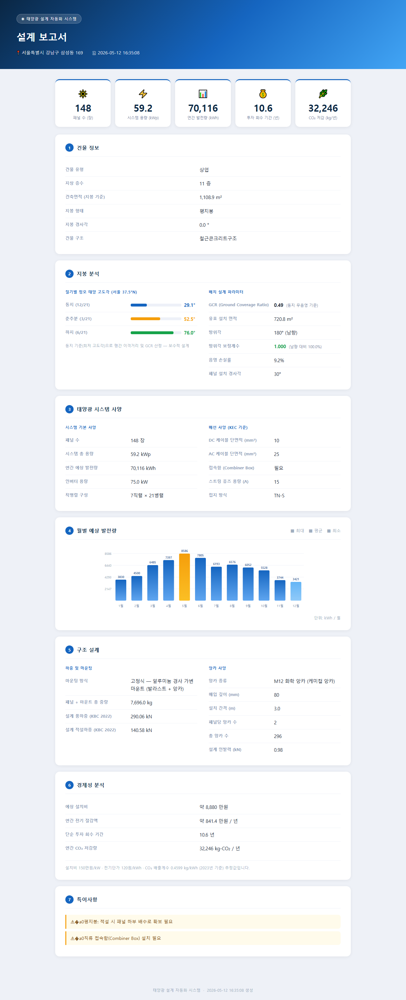
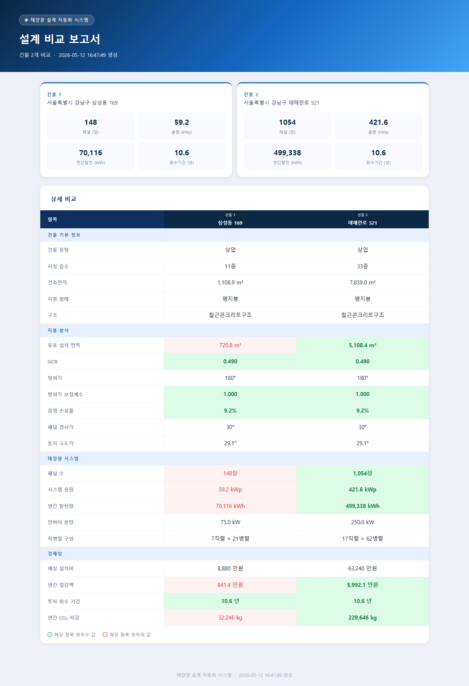

# ☀ 태양광 설계 자동화 시스템

[](https://github.com/songeunki/solar-design/actions/workflows/ci.yml)

주소 하나를 입력하면 건축물대장 조회 → 일사량 수집 → 지붕 분석 → 전기·구조 설계 → 보고서(HTML/PDF) 생성까지 전 과정을 자동화합니다.

---

## 주요 기능

| 기능 | 설명 |
|---|---|
| 주소 자동 변환 | 도로명·지번 주소 모두 지원. VWorld → Juso API 순으로 PNU 추출 |
| 건축물대장 조회 | 건축HUB API로 지붕 면적·형태·구조·층수 자동 수집 |
| 일사량 수집 | NASA POWER API로 위치별 월별 일사량·기온 climatology 수집 (API 키 불필요) |
| 지붕 분석 | 위도 기반 태양 고도각, 동지 무음영 GCR, 방위각 보정계수 계산 |
| 전기 설계 | 용량 산정, 표준 인버터 선정, 직병렬 구성, KEC 배선 사양 |
| 구조 설계 | KBC 2022 풍·적설 하중, 마운팅 방식, 앙카 사양 |
| 보고서 생성 | HTML + JSON + PDF (Playwright/Chromium) |
| 비교 보고서 | 여러 주소를 한 번에 분석해 항목별 비교표 생성 |

---

## 설치

### 1. 패키지 설치

```bash
pip install -r requirements.txt
python -m playwright install chromium
```

### 2. API 키 설정

`config.example.py`를 `config.py`로 복사한 후 키를 입력합니다.

```bash
cp config.example.py config.py
```

```python
# config.py
VWORLD_API_KEY   = "..."   # https://www.vworld.kr
BUILDING_API_KEY = "..."   # https://www.data.go.kr  (건축HUB 건축물대장 API)
JUSO_API_KEY     = "..."   # https://www.juso.go.kr  (도로명주소 개발자센터)
```

> **NASA POWER API**는 별도 키 없이 사용 가능합니다.

---

## 사용법

### 단일 주소 설계

```bash
python main.py --address "서울특별시 강남구 삼성동 169"
python main.py --address "서울특별시 강남구 테헤란로 521"
```

```
[1/5] 주소 조회: 서울특별시 강남구 삼성동 169
[2/5] 건물 정보 수집
[3/5] 기상 데이터 수집
[4/5] 지붕 분석 및 설계
[5/5] 보고서 생성
HTML: output/reports/서울특별시_강남구_삼성동_169_20260512_163508.html
PDF : output/reports/서울특별시_강남구_삼성동_169_20260512_163508.pdf
```

### 다중 주소 비교

```bash
python main.py --compare "서울특별시 강남구 삼성동 169" "서울특별시 강남구 테헤란로 521"
```

```
[1/2] 서울특별시 강남구 삼성동 169
       → 148장 / 59.2 kWp / 70,116 kWh/년

[2/2] 서울특별시 강남구 테헤란로 521
       → 1,054장 / 421.6 kWp / 499,338 kWh/년

[비교 보고서 생성]
HTML: output/reports/comparison_20260512_164749.html
PDF : output/reports/comparison_20260512_164749.pdf
```

---

## 보고서 구성

### 단일 설계 보고서

| 섹션 | 내용 |
|---|---|
| 1. 건물 정보 | 건축물대장 기반 유형·층수·면적·구조 |
| 2. 지붕 분석 | 절기별 태양 고도각, GCR, 방위각 보정계수, 음영 손실 |
| 3. 태양광 시스템 | 패널 수·용량·인버터·직병렬 구성·배선 사양 |
| 4. 월별 발전량 | SVG 막대 차트 |
| 5. 구조 설계 | 마운팅 방식·하중·앙카 사양 |
| 6. 경제성 분석 | 설치비·절감액·회수 기간·CO₂ 저감 |
| 7. 특이사항 | 구조 검토 필요 항목 등 |



### 비교 보고서

건물별 KPI 요약 카드 + 항목별 비교 테이블 (최우수 값 녹색·최하위 값 빨간색 강조)



---

## 테스트

```bash
pytest tests/ -v
```

```
============================= test session starts =============================
tests/test_address_api.py::TestAddressAPI::test_road_address_success PASSED
tests/test_address_api.py::TestAddressAPI::test_parcel_fallback PASSED
...
88 passed in 0.42s
```

실제 API 호출 없이 `unittest.mock`으로 전체 테스트가 실행됩니다.

| 파일 | 테스트 수 | 검증 내용 |
|---|---|---|
| `test_address_api.py` | 8 | road→parcel fallback, 네트워크 오류, 주소 파싱 |
| `test_building_api.py` | 14 | PNU 추출 3단계, Juso API, 건물 파싱, fallback |
| `test_roof_analyzer.py` | 18 | 태양 고도각, GCR, 방위각 보정, 경사지붕, 경고 노트 |
| `test_electrical.py` | 17 | 인버터 선정, 직병렬 구성, 방위각 보정 반영, 발전량 계산 |
| `test_structural.py` | 15 | 풍·적설 하중, 앙카 사양, 마운팅 방식, 경고 노트 |

---

## 프로젝트 구조

```
solar-design/
├── main.py                      # 진입점 (--address / --compare)
├── config.example.py            # API 키 설정 예시
├── data_collector/
│   ├── address_api.py           # VWorld 지오코딩 (도로명·지번)
│   ├── building_api.py          # 건축HUB + Juso API
│   └── weather_api.py           # NASA POWER API
├── analyzer/
│   └── roof_analyzer.py         # 태양 고도각·GCR·방위각 분석
├── designer/
│   ├── electrical.py            # 전기 설계
│   └── structural.py            # 구조 설계 (KBC 2022)
└── output/
    ├── report_generator.py      # HTML / PDF / 비교 보고서 생성
    └── reports/                 # 생성된 보고서 저장 (gitignore)
```

---

## 설계 계산 기준

### 태양 고도각 (서울 37.5°N)

| 절기 | 정오 고도각 |
|---|---|
| 동지 (12/21) | 29.1° |
| 춘추분 | 52.5° |
| 하지 (6/21) | 76.0° |

### GCR (Ground Coverage Ratio)

동지 정오 무음영 조건 기준으로 계산:

```
GCR = cos(β) / (cos(β) + sin(β) / tan(α_동지))
```

평지붕 30° 경사 설치 시: **GCR ≈ 0.49** (행간 이격 1.88 m)

### 방위각 보정계수

```
factor = 0.85 + 0.15 × cos(azimuth − 180°)
```

| 방향 | 보정계수 |
|---|---|
| 남향 (180°) | 1.00 |
| 동/서향 (90°/270°) | 0.85 |
| 북향 (0°/360°) | 0.70 |

---

## 사용 API

| API | 용도 | 키 필요 |
|---|---|---|
| [VWorld 지오코더](https://www.vworld.kr) | 주소 → 좌표·PNU | ✅ |
| [건축HUB 건축물대장](https://www.data.go.kr) | 건물 정보 조회 | ✅ |
| [도로명주소 Juso](https://www.juso.go.kr) | 도로명 → PNU 변환 | ✅ |
| [NASA POWER](https://power.larc.nasa.gov) | 일사량·기온 climatology | ❌ |
